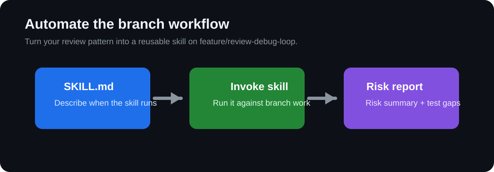

## Step 3: Automate Repetitive Tasks with Skills

Your next goal is to avoid repeating the same prompt patterns by codifying a reusable Copilot CLI skill.

### 📖 Theory: Reusable skills for consistent output

Skills package repeatable engineering tasks so Copilot CLI can produce structured output with less prompt overhead.

- Skills are best for recurring tasks with predictable deliverables.
- Standardized output enables easier grading and team adoption.
- Automation reduces drift between different feature branches.

Read more:
- https://docs.github.com/en/copilot
- https://docs.github.com/en/actions
- https://learn.github.com/skills

### ⌨️ Activity 1: Define a reusable review skill for your current branch

1. Stay on `feature/review-debug-loop` and create a skill definition at `.github/skills/pr-risk-summary/SKILL.md` for generating a PR risk and test-gap report.
1. Make sure the skill description clearly signals when Copilot CLI should use it and what structured output it should produce.

### ⌨️ Activity 2: Run the skill and refine the result

1. Run the skill in Copilot CLI for the work already living on `feature/review-debug-loop`.
1. Save the output to `artifacts/step3-risk-report.md` with these headings:
   - `## Invocation notes`
   - `## Risk summary`
   - `## Test gaps`
1. If the first run is too generic, tighten the skill wording and run it again.
1. Commit the skill definition and generated report to `feature/review-debug-loop`.

Having trouble? 🤷
 

- If you are unsure about skill format, keep it minimal: name, description, and expected output structure.
- Use concrete risk categories such as correctness, maintainability, and missing tests.
- This step should feel like an automation upgrade for the same branch, not a disconnected side task.

