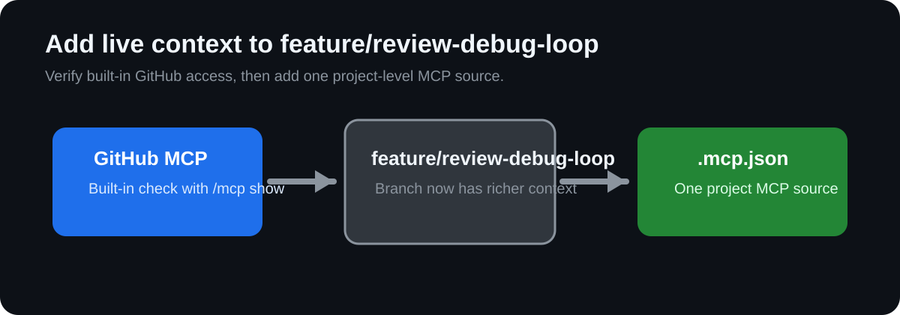

## Step 4: Connect to GitHub, Databases & APIs with MCP

You now need context-aware Copilot CLI outputs that incorporate external system data rather than local assumptions only.

### 📖 Theory: MCP as a context bridge

MCP servers let Copilot tools query external systems (GitHub, APIs, databases) so recommendations are grounded in real state.

- External context improves prioritization and decision quality.
- Controlled MCP configuration keeps data sources explicit and auditable.
- Validation logs help reviewers trust context-aware recommendations.

Read more:
- https://docs.github.com/en/copilot
- https://docs.github.com/en/rest
- https://docs.github.com/en/graphql

### ⌨️ Activity 1: Confirm built-in MCP access for your existing work

1. Stay on `feature/review-debug-loop` and use `/mcp show` or another GitHub-backed prompt to confirm the built-in GitHub MCP server is available in your environment.
1. Record what you checked and what MCP returned under `## Built-in MCP check` in your validation log.

### ⌨️ Activity 2: Add one project-level MCP server

1. Add MCP configuration at `.mcp.json` for one additional source such as the filesystem, documentation, an API endpoint, or a database integration.
1. Use Copilot CLI to produce a context-aware summary that combines the work on `feature/review-debug-loop` and MCP source data.
1. Create `artifacts/step4-mcp-validation-log.md` with these headings:
   - `## Built-in MCP check`
   - `## Source queried`
   - `## Context returned`
   - `## Action recommendation`
1. Commit `.mcp.json` and the validation log to `feature/review-debug-loop`.

Having trouble? 🤷
 

- For this exercise, use `.mcp.json` in the repository root. Do not use `.vscode/mcp.json`.
- Start with one MCP source only; keep scope narrow for easier validation.
- Include enough detail in the log so a reviewer can understand where context came from.
- By the end of this step, your review-debug branch should now include instructions, a skill, and MCP context you can carry into the capstone.

