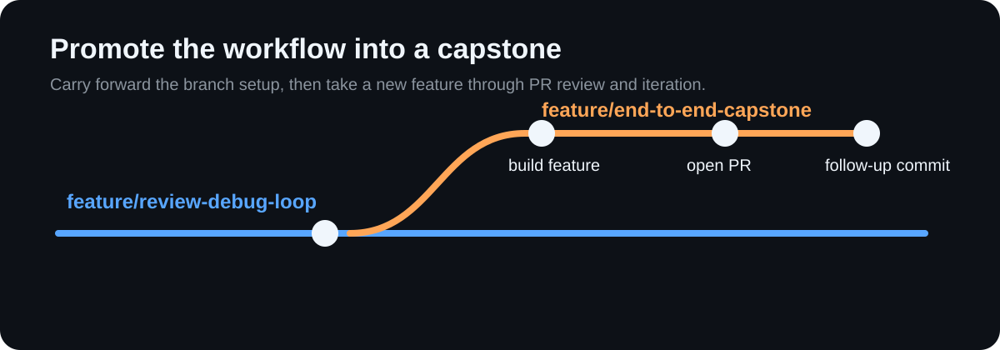

## Step 5: Putting It All Together

This final step validates that you can run a full feature workflow using specialized instructions, skills automation, MCP context, and review-driven iteration.

### 📖 Theory: End-to-end Copilot CLI orchestration

The highest leverage comes from chaining all advanced patterns into one delivery loop.

- Specialized instructions improve consistency.
- Skills reduce repetitive prompting.
- MCP context grounds recommendations in live data.
- Review iteration confirms practical delivery quality.

Read more:
- https://docs.github.com/en/actions
- https://docs.github.com/en/pull-requests
- https://learn.github.com/skills

### ⌨️ Activity 1: Promote your workflow into a capstone branch

1. Create a branch named `feature/end-to-end-capstone` from `feature/review-debug-loop` so your agent, instructions, skill, and MCP setup come forward into the final exercise.
1. Implement a small feature or enhancement on `feature/end-to-end-capstone`.
1. Use `/plan` or a natural planning prompt, your repository instructions, and your reusable skill to guide implementation and tests.
1. Record the prompt or approach you used under `## Plan prompt` in `artifacts/step5-end-to-end-summary.md`.

### ⌨️ Activity 2: Take the feature through review and iteration

1. Run MCP-assisted analysis and use the artifacts from Steps 2, 3, and 4 while preparing the feature for review.
1. Open a pull request from `feature/end-to-end-capstone`, request review, and submit at least one post-review commit.
1. Finish `artifacts/step5-end-to-end-summary.md` with these headings:
   - `## Plan prompt`
   - `## Steps 2, 3, and 4 artifacts used`
   - `## Review feedback received`
   - `## Post-review commit`

Having trouble? 🤷
 

- Keep the feature small so the focus stays on workflow orchestration.
- If you cannot get live review feedback immediately, use a teammate account or collaborator to submit one review comment.
- Reuse your earlier artifacts instead of recreating them from scratch.
- The capstone branch should feel like the natural continuation of the review-debug branch, not a fresh start.

